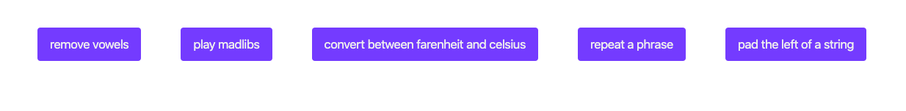

## JavaScript `soc-week-2-project` project

Starter Code exercises, that allows to improve your programming skills & practice javascript coding.

### Info

It starts with HTML page with five buttons, each of them related to a specific javascript code block. You should correct ot invent the code that missed and make them work as designed.

### Editing

You need open your project in browser to inspect and edit your functions in vcs with node debugger for review and edit the code.

### Screenshots

### Edited and Working Buttons. 

* [devowel](https://github.com/KLisabeth/soc-week-2-project/blob/master/challenges/devowel.js) 
* [madlib](https://github.com/KLisabeth/soc-week-2-project/blob/master/challenges/madlib.js)
